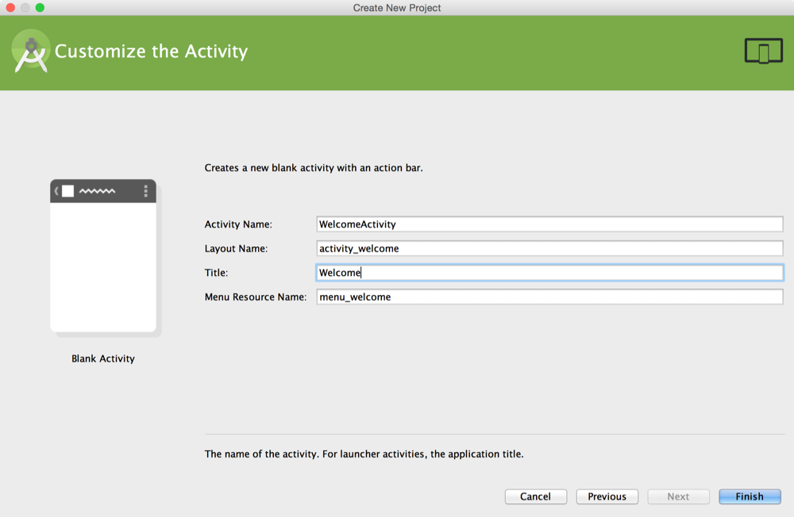
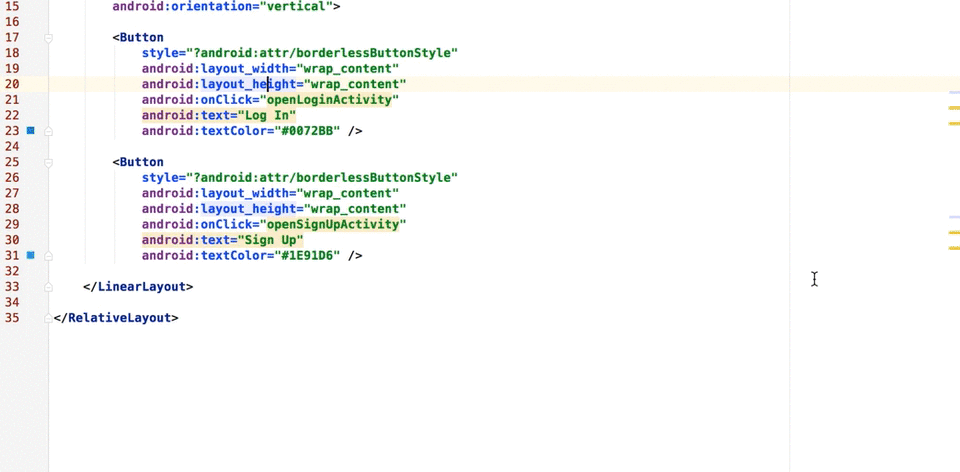
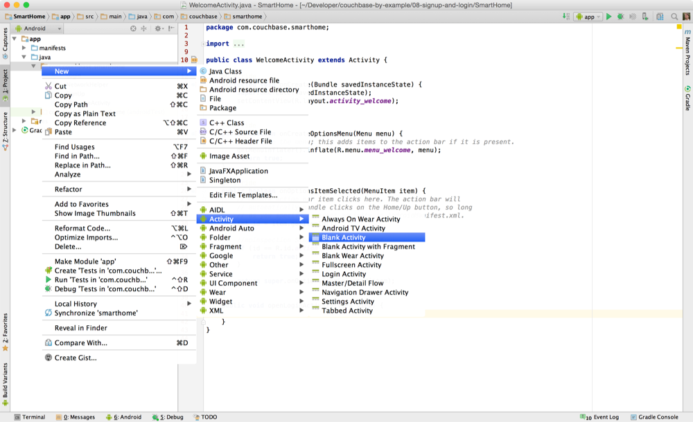
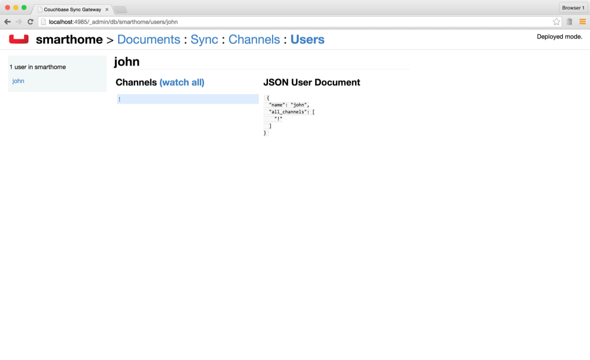
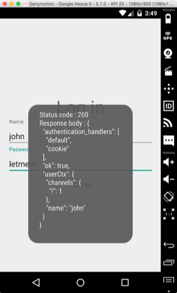

# Couchbase by Example: Adding user sign up to your Android app with Node.js and Couchbase Mobile.

With the Sync Gateway API, you can authenticate on the client side as a specific user to replicate the data this user has access to. In the case of basic authentication, the user must already exist in the Sync Gateway database. There are two ways to create users:

- In the configuration file under the `users` field.
- On the Admin REST API.

To provide a login and sign up screen, you must setup an app server that handles the user creation accordingly as the admin port (4985) is not publicly accessible. In this tutorial, you'll learn how to:

- Use the Admin REST API to create a user.
- Setup an App Server with Node.js to manage the users.
- Design a Login and Sign up screen in a sample Android app to test your App Server.

## Getting started

Download Sync Gateway and unzip the file:

> http://www.couchbase.com/nosql-databases/downloads#Couchbase\_Mobile

For this tutorial, you won't need a configuration file. For basic config properties, you can use the command line options. The binary to run is located in `~/Downloads/couchbase-sync-gateway/bin/`. Run the program with the `--help` flag to see the list of available options:

```bash
~/Downloads/couchbase-sync-gateway/bin/sync_gateway --help
Usage of /Users/jamesnocentini/Downloads/couchbase-sync-gateway/bin/sync_gateway:
  -adminInterface="127.0.0.1:4985": Address to bind admin interface to
  -bucket="sync_gateway": Name of bucket
  -configServer="": URL of server that can return database configs
  -dbname="": Name of Couchbase Server database (defaults to name of bucket)
  -deploymentID="": Customer/project identifier for stats reporting
  -interface=":4984": Address to bind to
  -log="": Log keywords, comma separated
  -logFilePath="": Path to log file
  -personaOrigin="": Base URL that clients use to connect to the server
  -pool="default": Name of pool
  -pretty=false: Pretty-print JSON responses
  -profileInterface="": Address to bind profile interface to
  -url="walrus:": Address of Couchbase server
  -verbose=false: Log more info about requests
```

For this tutorial, you will specify the `dbname`, `interface`, `pretty` and `url`:

```bash
~/Downloads/couchbase-sync-gateway/bin/sync_gateway -dbname="smarthome" -interface="0.0.0.0:4984" -pretty="true" -url="walrus:"
```

To create a user, you can run the following in your terminal:

```bash
$ curl -vX POST -H 'Content-Type: application/json' \
       -d '{"name": "adam", "password": "letmein"}' \
       :4985/smarthome/_user/
```

**NOTE**: The name field in the JSON object should not contain any spaces.

This should return a `201 Created` status code. Now, login as this user on the standard port:

```bash
$ curl -vX POST -H 'Content-Type: application/json' \
       -d '{"name": "adam", "password": "letmein"}' \
       :4984/smarthome/_session
```

The response will contains a `Set-Cookie` header and the user's details in the the body.

All of the Couchbase Mobile SDKs have a method to specify a user's name and password for authentication so you will most likely not have to worry about making that second request to login.

## App Server

In this section, you'll use the `/_user` Admin REST API endpoint publicly to allow users to sign up through the app.

You'll use the popular [Express](http://expressjs.com/) module to handle the request to create a user and the [request](https://github.com/request/request) module to proxy all other traffic to Sync Gateway.


Install the following Node.js modules:

```bash
npm install express body-parser request http-proxy --save
```

Open a new file `server.js` and add the following:

```javascript
var express = require('express')
  , bodyParser = require('body-parser')
  , request = require('request').defaults({json: true})
  , httpProxy = require('http-proxy');

// 1
var app = express();
app.use('/signup', bodyParser.json());

// 2
app.post('/signup', function (req, res) {
  console.log('its signup time');

  var json = req.body;
  var options = {
    url: 'http://0.0.0.0:4985/smarthome/_user/',
    method: 'POST',
    body: json
  };

  request(options, function(error, response) {
    res.writeHead(response.statusCode);
    res.end();
  });
});

// 3
app.all('*', function(req, res) {
  var url = 'http://0.0.0.0:4984' + req.url;
  req.pipe(request(url)).pipe(res);
});

// 4
var server = app.listen(8000, function () {
  var host = server.address().address;
  var port = server.address().port;

  console.log('App listening at http://%s:%s', host, port);
});
```

Here's what is happening step by step:

1. Instantiate a new instance of express and use the `bodyParser` middleware only if the path matches `signup`. Indeed, for all other requests proxied to Sync Gateway you need the raw request body.
2. Handle the `/signup` requests and use the request module to create the user on the admin port.
3. Proxy all other requests to Sync Gateway.
4. Start the Node.js web server on port 8000.

From now on, you will use the url below to create users through the app and kick off push/pull replications:

> http://localhost:8000

Create another user to test that everything is working as expected:

```bash
$ curl -vX POST -H 'Content-Type: application/json' \
       -d '{"name": "andy", "password": "letmein"}' \
       :8000/signup/
```

And to login as this user:

```bash
$ curl -vX POST -H 'Content-Type: application/json' \
       -d '{"name": "andy", "password": "letmein"}' \
       :8000/smarthome/_session
```

In the next section, you will create a simple Android app with a login and signup screen to test those endpoints.

## Android app

Open Android Studio and select **Start a new Android Studio project** from the **Quick Start** menu.

Name the app **SmartHome**, set an appropriate company domain and project location, and then click **Next**:


On the Target Android Devices dialog, make sure you check **Phone and Tablet**, set the Minimum SDK to **API 22: Android 5.1 (Lollipop)** for both, and click **Next**:


On the subsequent **Add an activity to Mobile** dialog, select Add **Blank Activity** and name the activity **Welcome Activity**:



To build the signup and login functionalities you will use two dependencies:

- **Android Design Support Library**: to have input text components that follow the Material Design spec.
- **OkHttp**: to handle the POST requests to `/signup` and `/smarthome/_session`. 

In `build.gradle`, add those dependencies:

```
compile 'com.android.support:design:22.2.1'
compile 'com.squareup.okhttp:okhttp:2.3.0'
```

In `activity_welcome.xml`, add the following **LinearLayout** inside of the existing **RelativeLayout**:

```xml
<LinearLayout
    android:layout_width="wrap_content"
    android:layout_height="wrap_content"
    android:layout_centerInParent="true"
    android:orientation="vertical">
    <Button
        style="?android:attr/borderlessButtonStyle"
        android:layout_width="wrap_content"
        android:layout_height="wrap_content"
        android:onClick="openLoginActivity"
        android:text="Log In"
        android:textColor="#0072BB" />
    <Button
        style="?android:attr/borderlessButtonStyle"
        android:layout_width="wrap_content"
        android:layout_height="wrap_content"
        android:onClick="openSignUpActivity"
        android:text="Sign Up"
        android:textColor="#1E91D6" />
</LinearLayout>
```

Notice that both buttons have an `onClick` attribute. Move the mouse cursor on one of the methods and use the `alt + enter` > `Create openLoginActivity(view)` shortcut to create that method in `WelcomeActivity`:



Do the same for the **Sign Up** button.

Next, create two new classes and XML layouts using the **Blank Activity** template. One should be called `Login` and the other `SignUp`:



Back in the `openLoginActivity` and `openSignUpActivity` methods, add the following explicit intents:

```java
public void openLoginActivity(View view) {
    Intent intent = new Intent(this, Login.class);
    startActivity(intent);
}

public void openSignUpActivity(View view) {
    Intent intent = new Intent(this, SignUp.class);
    startActivity(intent);
}
```

Change the parent class of `Login.java` and `SignUp.java` from `AppCompatActivity` to `Activity`.

In `res/values/styles.xml (v21)`, change the parent theme to `Theme.AppCompat.Light.DarkActionBar`.

Open `activity_sign_up.xml` and add the following inside of the **RelativeLayout** tag:

```xml
<LinearLayout
        android:layout_width="match_parent"
        android:layout_height="wrap_content"
        android:layout_centerInParent="true"
        android:orientation="vertical">

        <TextView
            android:layout_width="wrap_content"
            android:layout_height="wrap_content"
            android:text="Sign up"
            android:textSize="40dp" />

        <android.support.design.widget.TextInputLayout
            android:layout_width="match_parent"
            android:layout_height="match_parent">

            <EditText
                android:id="@+id/nameInput"
                android:layout_width="match_parent"
                android:layout_height="wrap_content"
                android:hint="Name" />
        </android.support.design.widget.TextInputLayout>

        <android.support.design.widget.TextInputLayout
            android:layout_width="match_parent"
            android:layout_height="match_parent">

            <EditText
                android:id="@+id/passwordInput"
                android:layout_width="match_parent"
                android:layout_height="wrap_content"
                android:hint="Password" />
        </android.support.design.widget.TextInputLayout>

        <android.support.design.widget.TextInputLayout
            android:layout_width="match_parent"
            android:layout_height="match_parent">

            <EditText
                android:id="@+id/confirmPasswordInput"
                android:layout_width="match_parent"
                android:layout_height="wrap_content"
                android:hint="Confirm password" />
        </android.support.design.widget.TextInputLayout>

        <Button
            style="?android:attr/borderlessButtonStyle"
            android:layout_width="wrap_content"
            android:layout_height="wrap_content"
            android:onClick="signup"
            android:text="Sign Up"
            android:textColor="#1E91D6" />

    </LinearLayout>
```

Now run the app and select the **Sign Up** button, you will see the Material Design EditText elements.

Create a new java class called `NetworkHelper` with the following:

```java
public static final MediaType JSON = MediaType.parse("application/json; charset=utf-8");

OkHttpClient client = new OkHttpClient();

Call post(String url, String json, Callback callback) {
    RequestBody body = RequestBody.create(JSON, json);
    Request request = new Request.Builder()
            .url(url)
            .post(body)
            .build();
    Call call = client.newCall(request);
    call.enqueue(callback);
    return call;
}
```

Before you can make HTTP request in your Android app, you first need to add the **Network** permission in `AndroidManifest.xml`:

```xml
<uses-permission android:name="android.permission.INTERNET" />
```

Now back in `SignUp.java`, add the following properties:

```java
NetworkHelper networkHelper = new NetworkHelper();

EditText nameInput;
EditText passwordInput;
EditText confirmPasswordInput;
```

Set the **EditText** components in the `onCreate` method:

```java
nameInput = (EditText) findViewById(R.id.nameInput);
passwordInput = (EditText) findViewById(R.id.passwordInput);
confirmPasswordInput = (EditText) findViewById(R.id.confirmPasswordInput);
```

Implement the `signup` method to send a POST request to `:8000/signup` with the name an password provided:

```java
public void signup(View view) {
    if (!passwordInput.getText().toString().equals(confirmPasswordInput.getText().toString())) {
        Toast.makeText(getApplicationContext(), "The passwords do not match", Toast.LENGTH_LONG).show();
    } else {
        String json = "{\"name\": \"" + nameInput.getText() + "\", \"password\":\"" + passwordInput.getText() + "\"}";
        networkHelper.post("http://10.0.3.2:8000/signup", json, new Callback() {
            @Override
            public void onFailure(Request request, IOException e) {
            }
            @Override
            public void onResponse(Response response) throws IOException {
                String responseStr = response.body().string();
                final String messageText = "Status code : " + response.code() +
                        "\n" +
                        "Response body : " + responseStr;
                runOnUiThread(new Runnable() {
                    @Override
                    public void run() {
                        Toast.makeText(getApplicationContext(), messageText, Toast.LENGTH_LONG).show();
                    }
                });
            }
        });
    }
}
```

Run the app and enter a name and password. If the user account was successfully created you will get back a `201 Created` status code and should see the newly created user on the Admin Dashboard:



Finally, let's finish off with the Login screen. In `activity_login.xml`, add the following in **RelativeLayout**:

```xml
<LinearLayout
    android:layout_width="match_parent"
    android:layout_height="wrap_content"
    android:layout_centerInParent="true"
    android:orientation="vertical">
    <TextView
        android:layout_width="wrap_content"
        android:layout_height="wrap_content"
        android:text="Log in"
        android:textSize="40dp" />
    <android.support.design.widget.TextInputLayout
        android:layout_width="match_parent"
        android:layout_height="match_parent">
        <EditText
            android:id="@+id/nameInput"
            android:layout_width="match_parent"
            android:layout_height="wrap_content"
            android:hint="Name" />
    </android.support.design.widget.TextInputLayout>
    <android.support.design.widget.TextInputLayout
        android:layout_width="match_parent"
        android:layout_height="match_parent">
        <EditText
            android:id="@+id/passwordInput"
            android:layout_width="match_parent"
            android:layout_height="wrap_content"
            android:hint="Password" />
    </android.support.design.widget.TextInputLayout>
    <Button
        style="?android:attr/borderlessButtonStyle"
        android:layout_width="wrap_content"
        android:layout_height="wrap_content"
        android:onClick="login"
        android:text="Log In"
        android:textColor="#0072BB" />
</LinearLayout>
```

Add the properties to `Login.java`:

```java
NetworkHelper networkHelper = new NetworkHelper();

EditText nameInput;
EditText passwordInput;
```

And do the same view binding operation in `onCreate`:

```java
nameInput = (EditText) findViewById(R.id.nameInput);
passwordInput = (EditText) findViewById(R.id.passwordInput);
```

Implement the `login` method:

```java
public void login(View view) {
    String json = "{\"name\": \"" + nameInput.getText() + "\", \"password\":\"" + passwordInput.getText() + "\"}";
    networkHelper.post("http://10.0.3.2:8000/smarthome/_session", json, new Callback() {
        @Override
        public void onFailure(Request request, IOException e) {
        }
        @Override
        public void onResponse(Response response) throws IOException {
            String responseStr = response.body().string();
            final String messageText = "Status code : " + response.code() +
                    "\n" +
                    "Response body : " + responseStr;
            runOnUiThread(new Runnable() {
                @Override
                public void run() {
                    Toast.makeText(getApplicationContext(), messageText, Toast.LENGTH_LONG).show();
                }
            });
        }
    });
}
```

Run the app and login with the user name and password that you previously chose. If the authentication was successfull, you will get back a 200 OK status code:



**NOTE:** All of the Couchbase Lite SDKs have a method on the `Replication` object that takes a name and password and performs the authentication for you so you will likely not have to make that POST request to `/smarthome/_session`.

## Conclusion

In this tutorial, you learnt how to use the Admin REST API to create users through a Sign Up screen in an Android app.